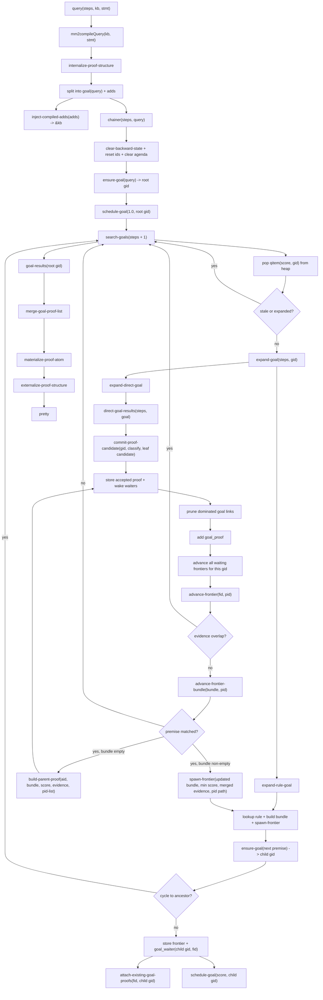
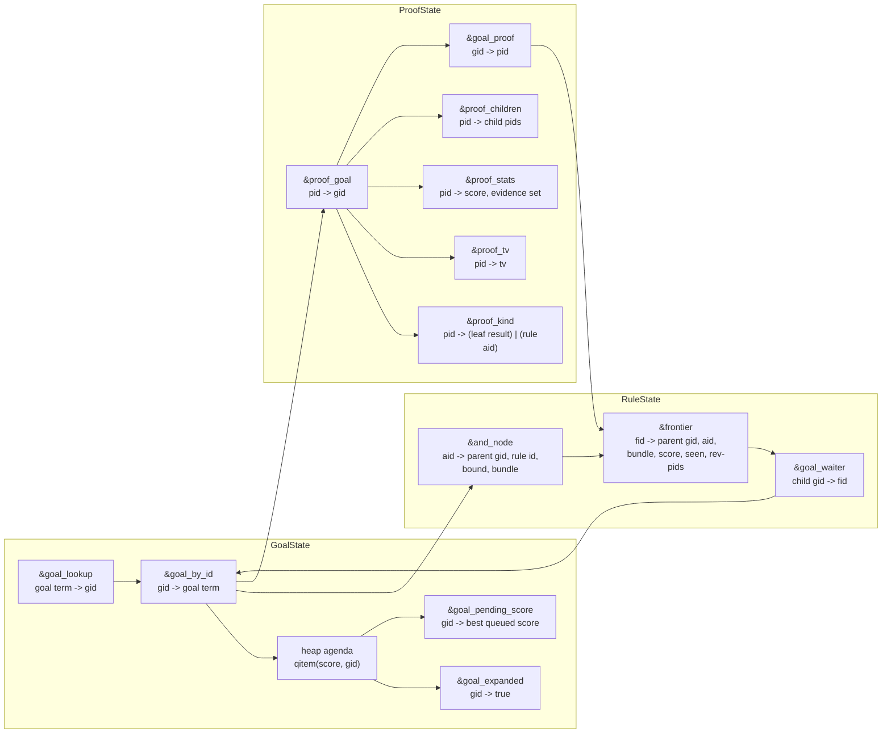

# Backward Chainer Flow

This describes the current backward chainer in terms of:

- control flow
- state transitions
- how goals, frontiers, and proofs feed each other

## Control Flow

## State Flow

## Information Flow Summary

- `gid` is the scheduling unit.
- `aid` is one rule application for one parent goal.
- `fid` is one partially satisfied path through an `aid`.
- `pid` is one proof alternative for one goal.

The main loop is:

1. A `gid` is popped from the heap.
2. The goal is expanded into direct proofs and rule options.
3. Rule options create `aid`s and `fid`s.
4. Child goals accumulate `pid`s.
5. New `pid`s wake any waiting `fid`s.
6. Completed `fid`s emit parent `pid`s.
7. Root `gid` proofs are merged and materialized at the end.

## Where Pruning Happens

- Queue staleness: `goal_pending_score`
- No re-expansion: `goal_expanded`
- Cycle blocking: `goal-has-ancestor?`
- Proof dominance: `proof-overlap-dominates?` inside `register-proof`
- Frontier reuse blocking: evidence overlap check inside `advance-frontier`

## Boundary

- External interface:
  - `(: kb prf type tv)`
- Internal runtime:
  - `(type kb prf tv)`
- Conversion happens only around `compileadd/query`.
